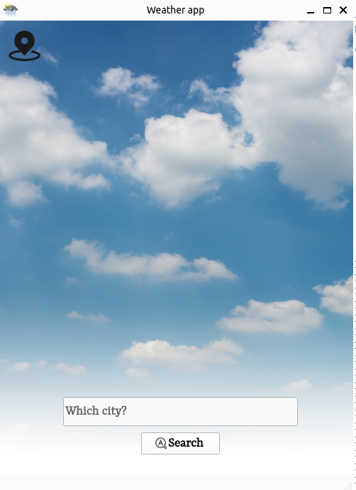
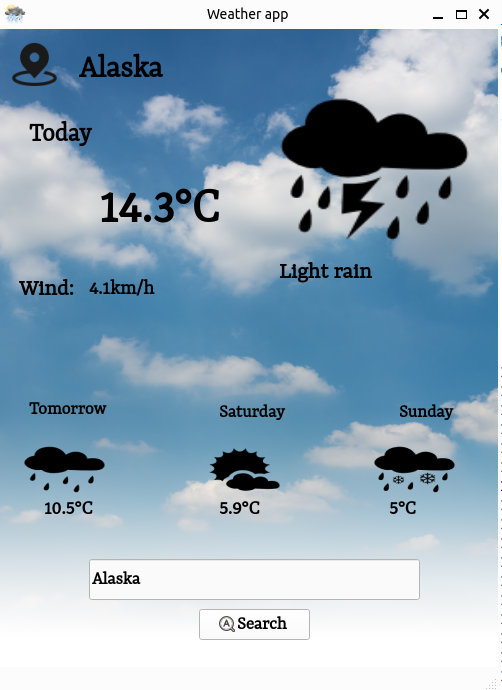
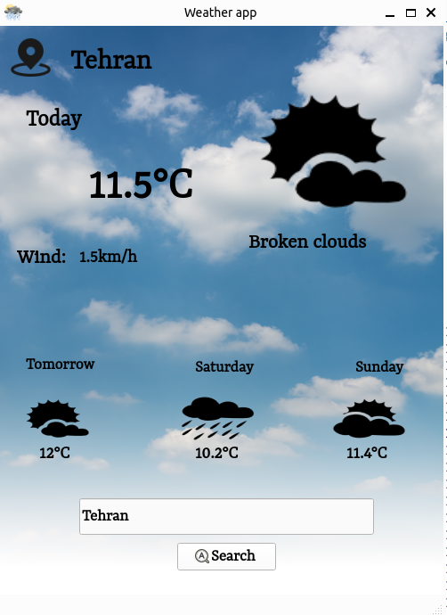
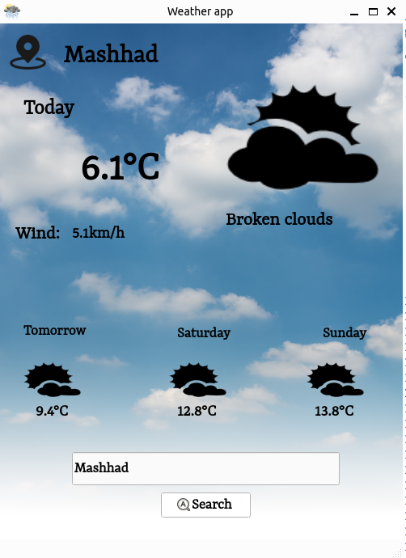

## GUI based Weather Forecast Application ☀️⛅️🌧️🌦️🌩️🌨️

### Description
#### To create this app we used:
- Qt for Ui design
- Python
-API link:  https://goweather.herokuapp.com/weather/Mashhad

#### Weather app outputs

##### Search page

##### Results with Tehran, Mashhad and Alaska cities

